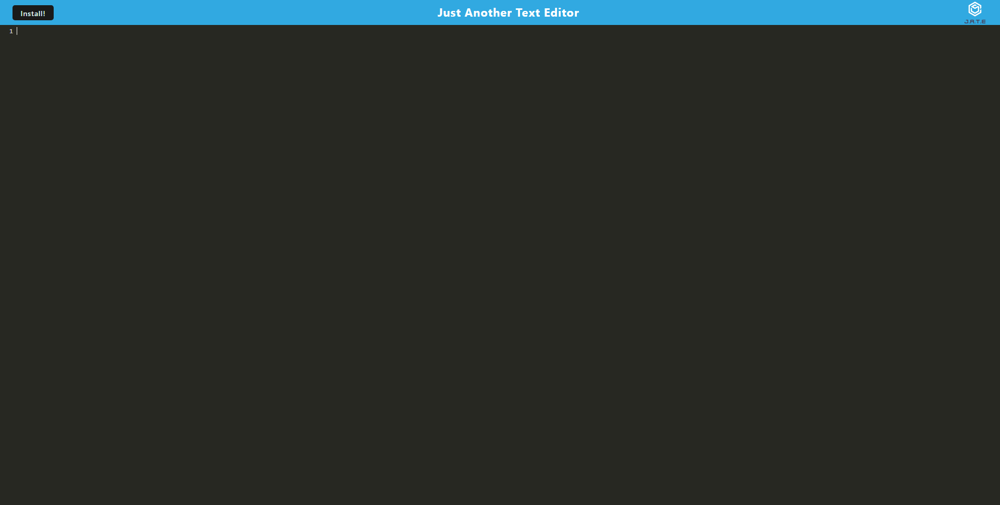

# Text Editor PWA
## Description

This project is a Text Editor that is used as a progressive Web App. The user can install this app on their browser to use its functionalities. 

## Installation
Download the repository on your machine and run "npm run start" to start the server. Opening the browser through the localhost port will allow the user to install the result project as a Web App.

## Screenshot
Below is how the Project initially appears to the user prior to installation as a Web App:

